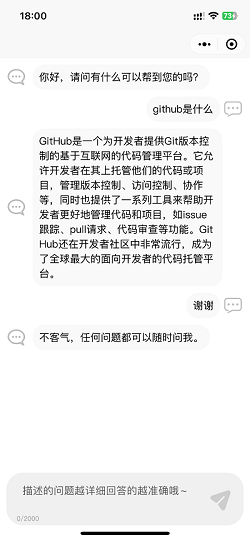

## 系统说明

- 基于 Spring Boot + Uniapp 开发的 **微信小程序+H5 ChatGPT**
- 轻量级 + 组件化 + 可扩展
- 可扩展敏感词过滤 + 高性能 + Websocket + SSE

## 免费体验

### 程序预览




公众号：一页一    ，回复 weso 获取小程序码

## 快速开始

### 核心依赖

| 依赖                          | 版本                                                   |
|-----------------------------|------------------------------------------------------|
| Spring Boot                 | 2.6.3                                                |
| yeee-memo                   | [通用web脚手架](https://github.com/yeeevip/yeee-memo.git) |

### 模块说明

```lua
yeee-chatgpt
├── app-h5
    ├── weso-chatgpt -- 客户端页面｜vue
├── yeee-chatgpt-bootstrap -- 主启动工程
├── yeee-chatgpt-client -- ChatGPT客户端服务
├── yeee-chatgpt-common -- 公共模块
```

### 本地开发 运行

#### 环境要求

- jdk1.8
- redis

```
# 下载[通用web脚手架]yeee-memo
git clone https://github.com/yeeevip/yeee-memo.git

cd memo-parent && mvn clean install

# 下载项目
git clone https://github.com/yeeevip/yeee-chatgpt.git

cd yeee-chatgpt-bootstrap/src/main/resources/application-test.yml  修改  openai.chat.[key] | openai.chat.[host]

# 运行ChatGPT服务
mvn clean install && java -jar -Dspring.profiles.active=test yeee-chatgpt-bootstrap/target/yeee-chatgpt-bootstrap-1.0.0-SNAPSHOT.jar

# 运行客户端ui
建议使用HbuilderX -> 导入app-h5/weso-chatgpt -> 编译运行在微信开发者工具/H5浏览器
```

### 其他说明

1. 欢迎提交 [PR](https://www.yeee.vip)，注意对应提交对应 `blog-dev` 分支

2. 欢迎提交 [issue](https://github.com/yeeevip/yeee-blog/issues)，请写清楚遇到问题的原因、开发环境、复显步骤。

## 技术交流群

作者QQ：1324459373
