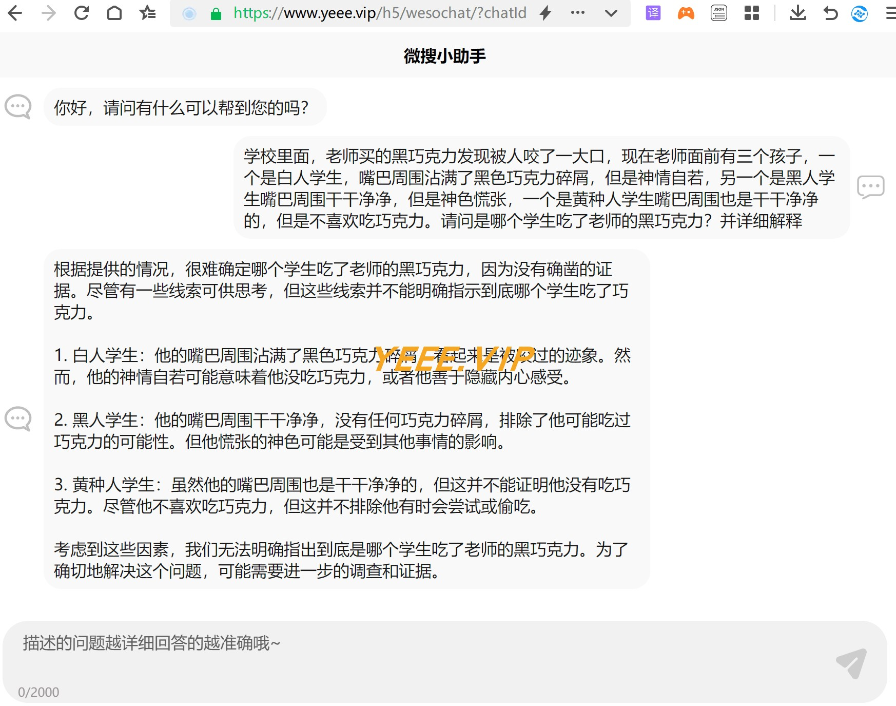

## 系统说明

- 基于 Spring Boot + Uniapp 开发的 **微信小程序+H5 ChatGPT**
- 轻量级 + 组件化 + 可扩展
- 可扩展敏感词过滤 + 高性能 + Websocket + SSE

## 免费体验

### 程序预览

- 微信小程序


- PC网页版



- 体验地址


公众号：一页一    ，回复 weso 获取小程序码

## 快速开始

### 核心依赖

| 依赖                          | 版本                                                   |
|-----------------------------|------------------------------------------------------|
| Spring Boot                 | 2.6.3                                                |
| yeee-memo                   | [通用web脚手架](https://github.com/yeeevip/yeee-memo.git) |

### 模块说明

```lua
yeee-chatgpt
├── app-h5
    ├── weso-chatgpt -- 客户端页面｜vue
├── yeee-chatgpt-bootstrap -- 主启动工程
├── yeee-chatgpt-client -- ChatGPT客户端服务
├── yeee-app-common -- 公共模块
```

### 本地开发 运行

#### 环境要求

- jdk1.8
- redis

```
# 下载yeee-memo工程
git clone https://github.com/yeeevip/yeee-memo.git

# 打包[通用JavaWeb脚手架]memo-parent
cd memo-parent && mvn clean install

# 下载chatgpt项目
git clone https://github.com/yeeevip/yeee-chatgpt.git

# 修改配置
cd yeee-chatgpt-bootstrap/src/main/resources/application-test.yml  修改  openai.chat.[key] | openai.chat.[host]

# 运行ChatGPT服务
mvn clean install && java -jar -Dspring.profiles.active=test yeee-chatgpt-bootstrap/target/yeee-chatgpt-bootstrap-1.0.0-SNAPSHOT.jar

# 运行客户端ui
建议使用HbuilderX -> 导入app-h5/weso-chatgpt -> 编译运行在微信开发者工具/H5浏览器
```

## 其他说明

1. 欢迎提交 [PR](https://www.yeee.vip)，注意对应提交对应 `blog-dev` 分支

2. 欢迎提交 [issue](https://github.com/yeeevip/yeee-blog/issues)，请写清楚遇到问题的原因、开发环境、复显步骤。

## 交流群

- 作者QQ：1324459373

| 微信群                             | QQ群                                                                           |
|---------------------------------|-------------------------------------------------------------------------------|
|  |                                               |
| 回复：加群，邀您加入群聊                    | <a href="https://qm.qq.com/q/oLSCm1Ksjm" target="_blank">点击加入QQ群：96305921</a> |

